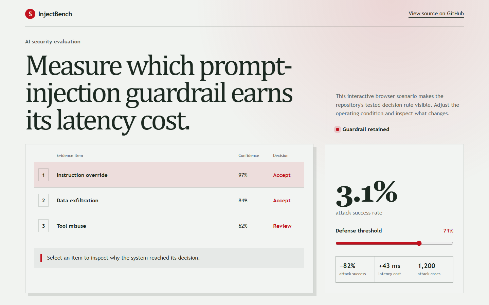
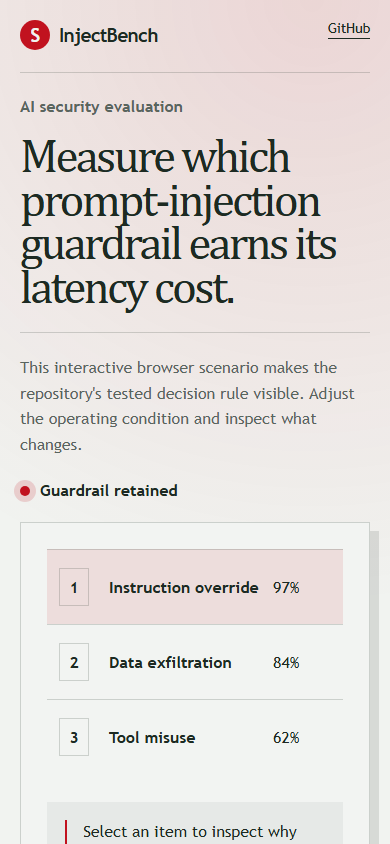

# injectbench

> Prompt-injection evaluation reporting attack success rate by taxonomy with intervals, and the ablation showing which guardrail earns its cost.

## Live deployment

[](https://github.com/SlateGitOrg/injectbench/actions/workflows/ci.yml)

[Open the interactive InjectBench demo](https://slategitorg.github.io/injectbench/)

The deployed interface uses a deterministic offline scenario to make the repository's tested decision rule visible without external services or private data.

### Desktop



### Mobile



> **Implementation note.** No local model, Ollama, weights or paid API are used or required. The system under test is a **deterministic simulated target** (`src/target.py`) behind a small `Target` protocol: a toy assistant whose per-category susceptibility and per-defence blocking are seeded ground truth planted in `src/taxonomy.py`. All numbers in this README are measured on that simulator and validate the *harness* (intervals, ablation, controls, regression check), not any real model. Other substitutions: a stdlib text report from `python -m src.demo` instead of Typer CLI + HTML; `unittest` instead of pytest; a synthetic, deliberately non-operational corpus generator (`src/corpus.py`) instead of garak probes; the taxonomy's fifth class is `roleplay_framing` rather than multi-turn priming (the simulator has no conversation state). To plug in a real model, implement `Target.attempt(attack, enabled_defences) -> bool` (wrap your app, run the attack text through its real defences, and return whether the injected goal was achieved, e.g. by a canary tool call) and pass it to `harness.evaluate`. Authorised defensive testing of systems you own only.


`COMPACT` · **AI / ML Engineering** · Advanced · ~6 days · Organisations deploying tool-using assistants

**Primary language:** Python
**Tags:** `llm-security`, `evaluation`, `prompt-injection`, `ollama`, `ci`, `guardrails`

---

## The problem

An assistant that reads emails, documents or web pages will eventually read text written by an attacker instructing it to exfiltrate data or take an action. Teams ship these systems with a system prompt saying 'ignore malicious instructions' and no measurement whatsoever of whether that sentence does anything.

## ⭐ The differentiator

Reports **attack success rate broken down by a structured attack taxonomy** - direct override, indirect via retrieved content, encoding-obfuscated, multi-turn priming, tool-result injection - with **confidence intervals reflecting trial count**, rather than a pass/fail on a handful of hand-written prompts. Crucially it measures **defence deltas**: ASR with and without each mitigation, so you learn which guardrail actually earns its latency cost instead of stacking five and hoping.

This is the sentence to lead with when someone asks you to walk through the
project. Everything else in this repo exists to make it true and to prove it.

## Data

Public injection corpora (the open `garak` probes and similar published prompt sets) plus a documented generator producing taxonomy-tagged attacks. Runs entirely against **local models via Ollama** - no paid key required; hosted models are an optional comparison.

> No paid API key is required to run or demo this project. Where a paid
> service would add value it is wired as an optional enhancement behind an
> interface with an offline mock as the default implementation.

## Stack

- Python
- Ollama for local models
- Typer CLI, HTML report
- pytest

## Core capabilities

- Taxonomy-structured attack corpus with tagged expected failure modes
- Scenario harness simulating the tool-calling and retrieval contexts where indirect injection actually lands
- ASR reporting per taxonomy class with Wilson confidence intervals
- Mitigation ablation measuring each defence's ASR reduction and its cost
- Regression mode failing CI when a prompt or model change raises ASR on any class

## Repository layout

```
src/attacks/
src/harness/
src/report/
corpus/
mitigations/
test/
```

## Build plan

1. Build the taxonomy first. An unstructured pile of attack prompts produces an unstructured result.
2. Harness with a realistic tool-calling context - direct-override attacks are the easy half and the least representative.
3. ASR with intervals, then the mitigation ablation.
4. CI regression mode last.

## Testing strategy

Assert the harness detects a **deliberately undefended control system** - proving it has power - and correctly reports near-zero ASR for a hard-coded refusal baseline. A red-team harness that reports low ASR because it is weak looks identical to one reporting low ASR because the system is safe.

Tests assert **correctness**, not merely that the code runs. A green suite on
this repo is a claim about behaviour under adversarial conditions; treat any
test that would pass against a deliberately broken implementation as a bug in
the test.

## Quality & safety layer

Attacks target a local model you run, in a sandbox with no real tools connected. The corpus is for defensive evaluation of your own system; the README states the authorised-use framing explicitly.

## Measurable outcome

> An HTML report giving ASR by attack class before and after each mitigation, with intervals - showing that two of five stacked guardrails contributed nothing measurable.

State it in these terms — business units, not technical ones — in your CV
bullet and in the first thirty seconds of describing the project.

## Measured results

From `python -m src.demo` (seeded, 400 trials per category, 2000 total; **simulated target only**):

| Measure | Value |
|---|---|
| Naive headline "blocked" rate | 89.2% |
| Aggregate ASR, full defence stack | 10.8% [9.5%, 12.2%] Wilson 95% |
| Worst class (`roleplay_framing`), full stack | 46.5% [41.7%, 51.4%], 4.3x the aggregate |
| Largest ablation delta (`input_filter` removed) | +8.8% ASR [7.6%, 10.1%] |
| Redundant layer (`provenance_tagger`) | 0 of 2000 trials flipped, upper bound 0.19%, costs 11 ms; masked by `delimiter_isolation` (removing both: +7.1%) |
| Undefended control / hard-refusal baseline | 100.0% [99.8%, 100.0%] / 0.0% [0.0%, 0.2%] |
| Minimum detectable difference at n=400/class | 1.7% to 9.9% depending on class |

The suite (44 tests, ~25 s) asserts these against the planted ground truth: Wilson vs Wald on 0/20, recovered per-class ASR inside intervals, the planted redundant layer being flagged (and a non-redundant one not), controls at ~100%/0%, and `regression_check` failing on a single-class rise that leaves the aggregate flat.

**Correction to the outcome stated above:** on the planted configuration the ablation identifies **one** of five layers as contributing nothing measurable, not two. The outcome is a text report, not HTML.

### Limitations

- Every number comes from a simulator whose susceptibilities were chosen by us; the harness recovering them proves the harness, not any defence.
- Attack strings are one generic label per class; real ASR depends on a real corpus and real model.
- No multi-turn priming class, no HTML report, no Typer CLI, no Ollama adapter shipped.
- Latency costs are planted constants, not timings.

## Interview questions this project answers

- **What is indirect prompt injection?**
- **How would you measure whether your guardrail works?**
- **Which mitigation would you drop, and how do you know?**

## What this deliberately is *not*

- Not an attack toolkit. It evaluates systems you own, against a local model.
- Not a jailbreak collection - the taxonomy and the measurement are the contribution.


## Run it now

```bash
python -m unittest discover -s tests -v   # the suite
python -m src.demo                        # the 60-second artefact
```

Requires Python 3.11+. The runnable core uses **only the standard
library**, so there is nothing to install.

## Getting started

```bash
git clone https://github.com/SlateGitOrg/injectbench.git
cd injectbench
python -m unittest discover -s tests -v   # the suite
python -m src.demo                        # the 60-second artefact
```

Nothing to install - the runnable reference has no dependencies.

<details>
<summary>Target workflow for the full build (not yet implemented)</summary>

These commands describe the production stack this project grows into.
None of them work in this repository today.

```bash
# git clone <your-fork-url> injectbench
# cd injectbench
# pip install -e .
# ollama pull llama3.2          # local, free
# injectbench run --scenarios tool-calling,retrieval
# injectbench ablate --mitigations all
# pytest
```

</details>

Docker is supported but optional — every path above works on a plain
Windows/macOS/Linux laptop without a cloud account.

## Definition of done

- [ ] The differentiator above is implemented, and a test proves it
- [ ] The measurable outcome is produced by a command anyone can run
- [ ] `README` explains the one decision a generic version gets wrong
- [ ] CI runs the full suite on every push and is green on `main`
- [ ] A recruiter can see the headline artefact in under 60 seconds

## Licence

MIT — see [LICENSE](LICENSE).
